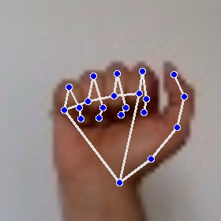
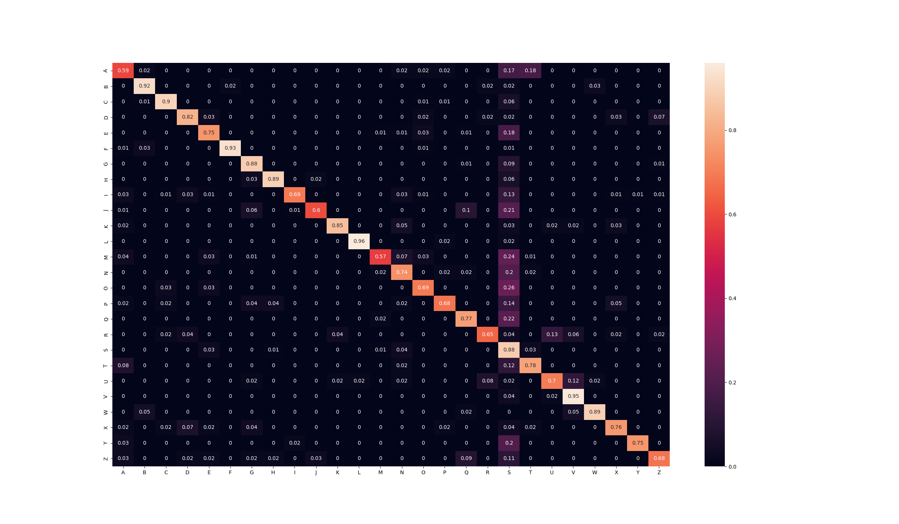

# ASL Alphabet Recognition: CNN and kNN

Ce projet implemente un systeme de reconnaissance de l'alphabet (et les chiffres) de la Langue des Signes Americaine (ASL). L'approche repose sur l'extraction de points caracteristiques de la main (landmarks) pour alimenter un CNN et kNN.


## Methodologie

Le pipeline de donnees utilise la bibliotheque Mediapipe pour transformer les images de mains en listes de landmarks :

1. **Extraction de caracteristiques** : Utilisation de Mediapipe Hands pour detecter 21 landmarks 3D sur la main de l'utilisateur.


2. **Traitement des donnees** : Les images brutes sont converties en vecteurs de coordonnees. Seuls ces vecteurs sont conserves pour l'entrainement, rendant le modele robuste aux variations d'eclairage et d'arriere-plan.



3. **Modelisation** :
    * **CNN (Convolutional Neural Network)** : Entraine sur les landmarks pre-traites. Ce modele offre des resultats satisfaisants (précision d'environ 85% sur le jeu de test) pour la classification de l'alphabet.
      
    * **kNN (k-Nearest Neighbors)** : Ce modele presente une precision mediocre (précision d'environ 50% sur le jeu de test), confirmant que la classification de signes complexes necessite une approche plus profonde que le simple calcul de distance euclidienne entre points.
      

## Gestion du Dataset

Par souci d'optimisation du stockage sur le depot, les images brutes ne sont pas incluses. Seuls les fichiers de landmarks pre-traites (.pt) sont fournis.

Le jeu de donnees original (dataset0 a dataset4) peut etre telecharge a l'adresse suivante :
<https://www.kaggle.com/datasets/ahmedkhanak1995/sign-language-gesture-images-dataset>

Pour re-entrainer les modeles, les images doivent etre placees dans les repertoires data/raw/ respectifs de chaque dossier (CNN ou KNN).

## Installation et Utilisation

### Installation

```bash
pip install -r requirements.txt
```

### Utilisation

Il faut lancer les scripts depuis la racine du dossier CNN ou KNN et avec l'option module de Python. Exemples:

```bash
# Pour tester le CNN
cd CNN
python3 -m scripts.live

# Pour tester le kNN
cd KNN
python3 -m scripts.live
```
